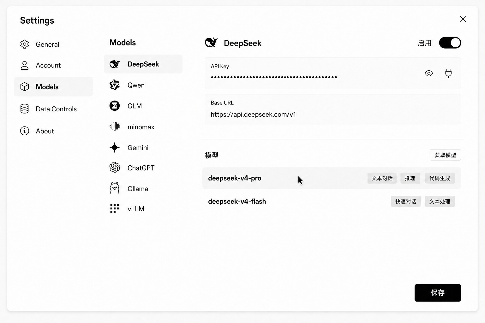
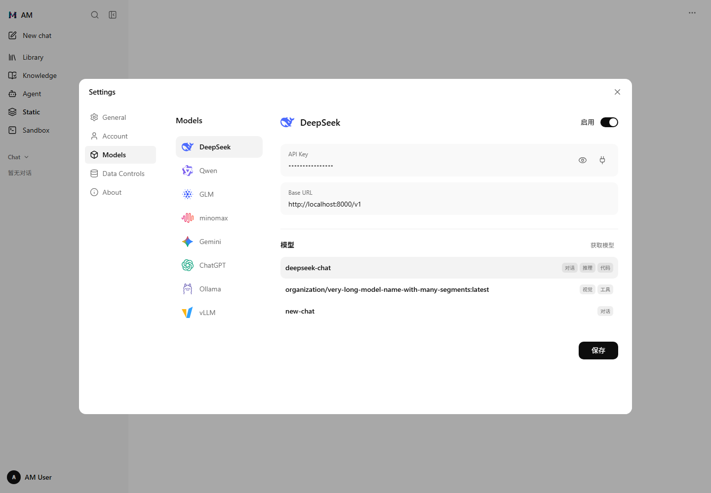

# Settings 模型管理方案
计划版本：v0.1.0

状态：代码实现与本地验证完成，环境联调待 T07；操作图标使用 Lucide，厂商使用彩色 SVG。

## 设计样例

- 三栏共用白色背景，通过留白区分设置导航、模型选项和详情。
- 配置区与具体模型不套卡片，不增加分栏边框或底部操作容器。
- 仅在配置与模型列表之间保留一条细分隔线，模型行之间不加线。
- 配置字段名称内嵌于浅色输入容器，容器内上方为名称、下方为字段值。
- 连接配置仅展示 API Key 与 Base URL，API Key 容器右侧内嵌单色插头图标用于检测，与显隐图标并列，不显示“检测”文字或按钮底色；不展示协议和请求头选项。
- 模型名称居左，能力以统一单色彩块包裹，在同一行最右侧对齐；不展示请求体覆盖字段或字样。
- 模型行默认无背景、无边框，hover 时仅加深行背景。样例图第一行展示 hover 状态。

## 执行顺序与落点

本计划以 `spec.md` 的 MODEL-SETTINGS-001～005 为现行要求。代码任务执行状态见 tasks.md，
设计图仅作为布局依据，不能作为真实模型能力或连接状态的数据来源。

1. **设置入口与布局（T02，MODEL-SETTINGS-001～002）**：在
   `web/src/components/SettingsComponent.vue` 的 `SettingsSectionId`、`sections`、
   `activeSection` 对应内容分支中接入 Models，保留对话框与一级导航的现有所有权。
   模型区域实现供应商选项列与详情列，按设计图调整宽度、对齐与留白。
2. **配置与模型行（T03～T04，MODEL-SETTINGS-003～004）**：在 Models 内容模板中实现
   两个内嵌名称的配置输入、启用开关、密钥显隐与插头检测图标；模型行使用
   `flex` 布局，名称居左，能力标签组以 `ml-auto` 靠右，同一行垂直居中。
   默认行背景透明，使用 `hover` 样式加深背景，不通过新增状态层处理悬停。
   使用已有 Lucide 图标与 Tailwind，不为字段、标签、行或图标分别创建包装组件。
3. **数据与操作（T05，MODEL-SETTINGS-002～004）**：实施时核对现有模型管理服务及其
   API 暴露情况，在 `web/src/api/` 承载传输，在模型功能的 composable 中组织加载、
   保存、远程获取与检测，展示组件仅消费状态和触发操作。
   供应商记录以 `provider_id` 标识，功能标签使用明确的真实数据来源。
   后端协议、额外请求头与请求体覆盖沿用后端合同，页面不提供这些编辑项；
   保存时不得因字段未展示而清空已有配置。
4. **验证（T06，MODEL-SETTINGS-001～004）**：逐项对照设计图与任务清单进行浏览器验证，
   再运行前端类型检查、lint、build 与差异检查，分别记录界面验证和静态检查结果。

## 交互执行示例与失败处理

管理 API 落于 `server/router/model_router.py`，字段合并、临时探测与能力提取落于
`server/service/model_service.py`，DTO 落于 `server/entities/model.py`；沿用登录认证。
前端由 `SettingsModelsComponent.vue` 承载模型功能，`useModelSettings.ts` 组织请求和临时编辑状态。
厂商 SVG 复用 `web/src/assets/models/`，补齐缺失资源，不安装新图标依赖。

目标为 `SettingsComponent.vue` 的 Models 内容分支及其模型功能 composable：
选择 DeepSeek → 加载对应供应商记录 → 编辑 API Key / Base URL → 点击输入框内插头图标
→ 使用当前表单参数检测连接。请求进行中禁用重复检测，结束后恢复；失败保留输入，
使用现有反馈方式展示实际错误，不提前显示成功状态。

选择不同模型供应商时，显示对应配置和模型列表；保存成功后以服务端结果更新当前记录。
保存或获取模型失败时保留现有编辑值或列表，避免用空结果覆盖已有内容。
样例中的模型名称与能力不硬编码为生产数据。

## 验证重点

- 桌面、窄屏和长模型名称下，模型名称与最右侧能力保持单行，名称可截断，能力可读。
- API Key 内只显示显隐和插头图标，图标可通过键盘操作且有无障碍名称。
- hover 仅加深模型行背景；模型区域没有卡片、行分隔线、请求体覆盖或二级描述行。
- 配置区域只有 API Key 与 Base URL；检测不出现可见文字，也不在底部重复出现。
- 实际验证供应商切换、启用、保存、远程获取、检测成功与失败；不把静态图视为交互验证。

## 执行记录

### 个人配置执行补充

按用户本轮要求和 MODEL-SETTINGS-005～006：新增 `useModelProviderStore.ts` 承载列表及详情请求；
`useModelSettings.ts` 保留本地草稿，按选中供应商加载详情，不把密钥放入 Store。
Store 监听认证凭证变化同步清空；异步响应写入前比对请求所属会话，composable 同步丢弃旧账号输入和探测结果。
后端所有权与迁移落点见 `docs/spec/model/provider-management/plan.md`，本轮不改变页面布局。

此补充已实现并验证：列表/详情在当前账号 Store 内缓存，输入 Key 留在 composable；退出或换账号清空，迟到响应不会覆盖新账号。
模型管理现在必须通过 HTTPS 访问，修改 Base URL 后需要重新提供已有 Key，旧私有请求头不转发到新地址。
此前执行记录中的 31 项测试为上一轮结果；当前个人配置及安全测试共 43 项通过，详见模型能力执行计划。

实现入口：`web/src/components/SettingsComponent.vue`、`SettingsModelsComponent.vue`；
请求状态由 `web/src/composables/useModelSettings.ts` 管理，HTTP 传输复用 `web/src/api/model.ts`。
后端路由通过 `AuthenticatedUser` 保护；临时表单合并、保存及探测复用模型服务与仓储。
远程模型经选择框勾选后加入列表；未返回明确能力元数据的模型不生成推测标签。
已有密钥不回传，省略时保留；界面隐藏的后端参数由服务端合并保留。

| 验证 | 结果 |
| --- | --- |
| 模型服务、仓储、缓存及 Settings 测试 | 31 项通过；SQLite、HTTP mock、ASGI 路由测试 |
| 前端 typecheck / build | 通过；构建仍有大 chunk 提示 |
| 修改文件的 ESLint / 后端 Ruff / 差异检查 | 通过 |
| 全量前端 lint | 未通过：已有 `LibraryView.vue:9` 未使用变量错误，以及其他未修改文件的既有样式警告 |
| 浏览器布局 | 1440、1024、768、390、320 宽度，无对话框溢出；长名称截断、能力右对齐同一行 |
| 浏览器交互 | API mock 下验证密钥显隐、保存、模型勾选、供应商切换、检测成功/失败与输入保留、hover、Enter 检测及 Escape 关闭选择框 |
| 运行环境 | 缺少 docker 命令，Worker 未重建；未使用真实厂商密钥，未完成真实 PostgreSQL / Redis / 厂商联调 |

## 实际页面

以下为浏览器截图，数据来自测试夹具，不表示真实厂商连接状态。

[手机实际页面](implemented-mobile.png)
